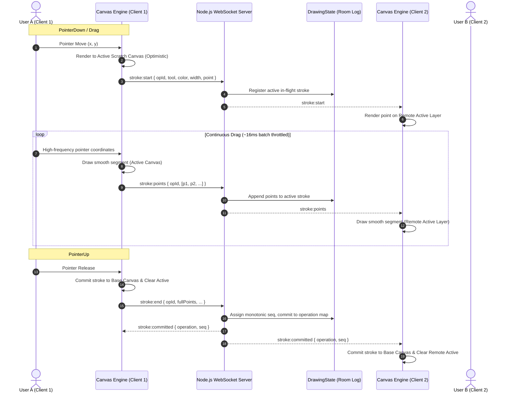

# 📐 System Architecture & Technical Specifications

This document outlines the architectural choices, real-time protocols, conflict resolution strategies, and performance considerations for **SyncDraw**.

---

## 1. High-Level Data Flow Diagram



---

## 2. WebSocket Wire Protocol

All real-time communication occurs over Socket.IO event channels scoped per room.

### Client-to-Server Events

| Event Name | Payload Format | Description |
|---|---|---|
| `room:join` | `{ roomId: string, userName: string, userColor: string }` | Client joins an isolated whiteboard room. |
| `stroke:start` | `{ opId: string, tool: string, color: string, width: number, point: {x, y} }` | Emitted when pen/pointer touches down. |
| `stroke:points` | `{ opId: string, points: Array<{x, y}> }` | Throttled stream of intermediate points (~60Hz). |
| `stroke:end` | `{ opId: string, tool: string, color: string, width: number, points?: Array<{x, y}>, startPoint?: {x, y}, endPoint?: {x, y} }` | Emitted when pointer is lifted, finalizing the operation. |
| `stroke:cancel` | `{ opId: string }` | Emitted if gesture is cancelled (`pointercancel`). |
| `cursor:move` | `{ x: number, y: number, isDown: boolean, tool: string }` | Throttled (~30Hz) cursor coordinates in logical space. |
| `cursor:leave` | *(none)* | Emitted when pointer exits the canvas boundary. |
| `history:undo` | `{ mode: 'global' \| 'user' }` | Requests an undo operation. |
| `history:redo` | `{ mode: 'global' \| 'user' }` | Requests a redo operation. |
| `canvas:clear` | *(none)* | Requests full room canvas wipe (recorded as an undoable op). |
| `latency:ping` | `{ clientTime: number }` | Measures network roundtrip time. |

### Server-to-Client Events

| Event Name | Payload Format | Description |
|---|---|---|
| `init:state` | `{ user: object, room: object, snapshot: object, users: array }` | Initial synchronization payload sent to connecting user. |
| `stroke:start` | `{ opId, userId, userName, userColor, tool, color, width, point }` | Informs peers of a new in-progress stroke. |
| `stroke:points` | `{ opId, points }` | Broadcasts chunk of streamed points. |
| `stroke:committed` | `{ operation: object, sequenceNumber: number }` | Authoritative confirmation that an operation is committed. |
| `cursor:update` | `{ userId, userName, userColor, cursor: {x, y, isDown, tool} }` | Updates peer cursor position on cursor overlay. |
| `cursor:leave` | `{ userId: string }` | Hides cursor for peer that left canvas. |
| `history:undone` | `{ opId: string, undoneBy: string, sequenceNumber: number }` | Informs room of an operation tombstoned by undo. |
| `history:redone` | `{ opId: string, operation: object, redoneBy: string, sequenceNumber: number }` | Informs room of an operation restored by redo. |
| `canvas:cleared` | `{ operation: object, clearedBy: string, sequenceNumber: number }` | Informs room of canvas clear. |
| `user:joined` | `{ user: object, users: array }` | Informs room that a new user connected. |
| `user:left` | `{ userId: string, userName: string, users: array }` | Informs room that a user disconnected. |
| `latency:pong` | `{ clientTime: number, serverTime: number }` | Response used by client to compute roundtrip latency. |

---

## 3. Global Undo / Redo Strategy (The Core Challenge)

Handling multi-user undo/redo in collaborative graphics is fundamentally different from single-user editors. If User A draws, User B draws, and User A clicks "Undo":
- **Naive approach**: Clear the canvas and redraw everything except the last stroke.
  - *Failure mode*: Loses in-flight strokes, causes flicker, and cannot distinguish who drew what.
- **SyncDraw approach**: **Server-Authoritative Tombstone Operation Log**.

### The State Machine

```
Chronological Committed Log: [Op1 (User A), Op2 (User B), Op3 (User A)]
Tombstones (Undone Set):     {}
Redo Stack:                  []

Action: User B clicks "Global Undo"
1. Server inspects committed log in reverse chronological order.
2. Finds Op3 as the latest operation not in Tombstones.
3. Adds Op3 to Tombstones: { Op3 }
4. Pushes Op3 to Redo Stack: [Op3]
5. Broadcasts `history:undone { opId: 'Op3' }` to ALL clients.
6. All clients mark Op3 as isUndone = true and replay active operations onto Base Canvas.

Action: User A clicks "Global Redo"
1. Server pops Op3 from Redo Stack: []
2. Removes Op3 from Tombstones: {}
3. Broadcasts `history:redone { opId: 'Op3' }` to ALL clients.
4. All clients re-render Op3 onto Base Canvas.
```

### Why Tombstones over Array Deletion?
1. **Auditability & Traceability**: Operations are never permanently destroyed; their history and ownership remain intact.
2. **Deterministic Sequence Preservation**: Existing monotonic sequence numbers remain unshifted.
3. **Selective User Undo Support**: By checking `op.userId === requestingUserId`, the same engine effortlessly supports "Undo My Last Stroke Only" without altering the global timeline.

---

## 4. Conflict Resolution Strategy

### Simultaneous Overlapping Strokes
When User A and User B draw across the same pixel area at the exact same millisecond:
1. **Optimistic Local Execution**: Both clients draw locally onto their own active scratch canvases with 0ms perceived latency.
2. **Server-Authoritative Total Ordering**: The server receives `stroke:end` from both clients. The server's single-threaded event loop naturally orders incoming commits:
   - Stroke A arrives at $T_0 \rightarrow$ assigned `seq: 14`
   - Stroke B arrives at $T_0 + 2\text{ms} \rightarrow$ assigned `seq: 15`
3. **Idempotency & Sequence Consensus**: Operations are uniquely identified by a client-generated UUID (`op_<timestamp>_<random>`). Both clients commit strokes to their base canvases in arrival order. Because the base canvas operates as a standard alpha-blended 2D framebuffer, overlapping strokes stack deterministically.
4. **Disconnections During Active Drawing**: If a user disconnects while holding the mouse down, the server intercepts the socket `disconnect` event, cleans up their in-flight stroke from `activeStrokes`, and broadcasts `stroke:cancel` to peers, preventing ghost strokes.

---

## 5. Performance Decisions & Canvas Mastery

### 1. Dual-Canvas Layering (Avoid Full Redraws)
- **The Problem**: Freehand drawing generates 60–120 mouse move events per second. If we clear and redraw the entire canvas on every mouse move, performance degrades rapidly as history grows.
- **The Solution**:
  - `Base Canvas`: Dedicated to committed, finalized artwork. Only touched when a stroke is completed, cleared, or undone.
  - `Active Canvas`: Dedicated to in-flight strokes and preview shapes. On pointer move, only the new quadratic segment is drawn incrementally onto this transparent scratch layer.

### 2. Path Optimization via Quadratic Bezier Midpoint Interpolation
- **The Problem**: Drawing raw `lineTo` between mouse coordinates produces jagged, angular polygon edges due to pointer event discretization.
- **The Solution**:
  $$\text{Midpoint } M_i = \left( \frac{P_{i-1}.x + P_i.x}{2}, \frac{P_{i-1}.y + P_i.y}{2} \right)$$
  Using `ctx.quadraticCurveTo(P_{i-1}.x, P_{i-1}.y, M_i.x, M_i.y)`, we achieve buttery-smooth curves with minimal mathematical overhead. Redundant micro-movements ($< 1.5$ logical pixels) are filtered out before appending.

### 3. HiDPI (Retina) Pixel Ratio Scaling
- To prevent blurry rendering on high-density displays:
  $$\text{bufferWidth} = \text{displayWidth} \times \text{devicePixelRatio}$$
  $$\text{bufferHeight} = \text{displayHeight} \times \text{devicePixelRatio}$$
  Canvas style dimensions are set to CSS pixels, while canvas internal dimensions are scaled by `dpr`. `ctx.setTransform(scaleX, 0, 0, scaleY, 0, 0)` ensures sub-pixel precision.

### 4. Normalized Logical Coordinate Space
- Display viewports differ across laptops, tablets, and phones.
- All drawing coordinates are mapped to a normalized `1920x1080` logical coordinate space before transmission:
  $$x_{\text{logical}} = \frac{x_{\text{screen}} - \text{rect.left}}{\text{rect.width}} \times 1920$$
  This ensures that a stroke drawn on an iPhone will land at the exact same proportional location on a 4K desktop monitor.

### 5. Event Batching & Throttling
- Raw pointer events fire at up to 120Hz–240Hz on high-refresh gaming mice and iPads.
- Sending a WebSocket packet per coordinate saturates TCP buffers and causes packet queuing.
- Coordinates are buffered in a queue and flushed every **16ms (~60Hz)** in small coordinate delta batches. Peer cursor movement is throttled to **35ms (~30Hz)**.

---

## 6. Scaling to 1,000+ Concurrent Users

If tasked with scaling this architecture to large production workloads:

1. **Horizontal WebSocket Scaling**:
   - Deploy multiple Node.js instances behind an NGINX or AWS ALB load balancer with sticky sessions.
   - Use the **`@socket.io/redis-adapter`** so socket broadcasts distribute across all backend worker nodes via Redis Pub/Sub.
2. **Spatial Partitioning (Viewport Culling)**:
   - For infinite canvas boards (like Miro or Figma), partition the canvas into quadtrees or spatial grid chunks.
   - Clients only subscribe to coordinate events within their current visible viewport bounding box.
3. **Canvas Checkpoint Snapshots**:
   - Every 50 operations, compress the canvas state into an offscreen raster bitmap snapshot.
   - When an undo occurs within the last 50 operations, the client restores the snapshot and replays only the recent operations, reducing redraw time from $O(N)$ to $O(1)$.
4. **Binary Wire Serialization**:
   - Replace JSON payloads with binary array buffers (e.g. Protocol Buffers, FlatBuffers, or raw `Int16Array` typed arrays), reducing bandwidth consumption by over 75%.
